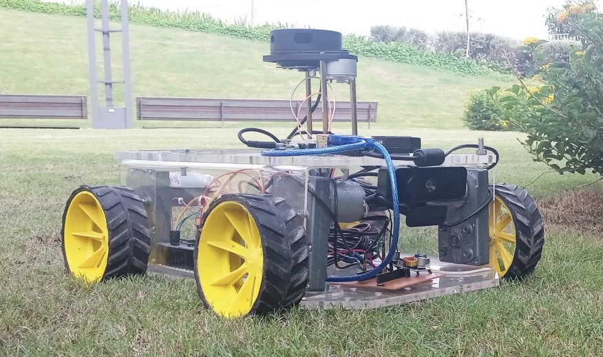
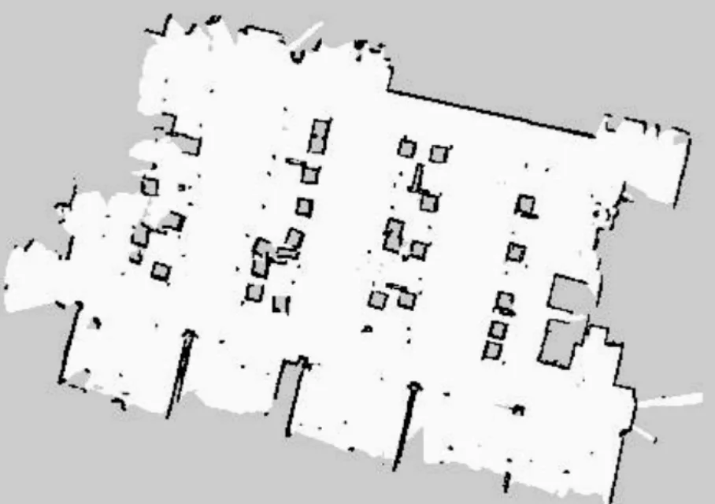

# AgriBot

The ground-robot (UGV) subsystem of a multi-agent precision-agriculture platform built at the **Low Altitude Remote Sensing (LARS)** group, Plaksha University, under Prof. Sunita Chauhan. The broader project pairs UAVs - which map large fields and flag stress zones from multispectral imagery — with a ground vehicle that can be sent in for closer, leaf-level inspection and intervention. This repo holds the CAD, ROS2 software, and mapping tools for that ground vehicle.

More background and info: [suraj1102.github.io — Summer Research Intern, LARS](https://suraj1102.github.io/experience/summer-intern-lars/)


## What's here

A testbed robot was built with LiDAR, IMU, GPS, ultrasonic sensors, and a camera, integrated over a ROS2 pipeline, along with a 4-DOF manipulator arm (3 links fabricated) for close-up inspection.



### Manipulator (`CAD/`, `ros2_ws/src/arm_assembly`)

The 4-DOF arm was designed in Onshape (`CAD/Arm Assembly v6.step`, `.3mf`) and exported to URDF via `onshape-to-robot` (`CAD/onshape_to_urdf/`, mirrored under `ros2_ws/RawFiles/URDFs/`). The ROS2 package `arm_assembly` publishes this URDF and launches `robot_state_publisher` + `joint_state_publisher_gui` + RViz for visualization, and was simulated in Gazebo. On the physical arm, the 3 fabricated links are driven by PID controllers using encoder and IMU feedback.

```
ros2 launch arm_assembly display.launch.py
```


### Mapping (`ImagesToMaps/`)

Static occupancy-grid maps for navigation are generated two ways:

- **From LiDAR scans** of an indoor space (robotics lab), producing a 2D occupancy grid.
- **From drone imagery**, via a photogrammetry pipeline (OpenDroneMap) that reconstructs a point cloud, which `generate_occupancy_map.py` then flattens into a heightmap and thresholds into an occupancy grid (`map.pgm` / `map.yaml`), after segmenting out the ground plane with RANSAC.


| From LiDAR | From drone imagery |
| --- | --- |
|  |  |

## Repo layout

```
CAD/                 Onshape exports of the arm assembly (STEP, 3MF) + generated URDF/meshes
ros2_ws/
  src/arm_assembly/  ROS2 package: URDF, RViz/Gazebo config, display launch file
  RawFiles/          Raw onshape-to-urdf export (URDFs + meshes)
ImagesToMaps/         Occupancy-map generation from LiDAR and drone imagery point clouds
imgs/                 Project photos and poster
```

## Future work

An ATV has since been procured for field trials, with the control and mission-planning software from this testbed being integrated onto it for outdoor automation.

## Team

Prof. Sunita Chauhan (supervisor), Ananya Shukla, Jia Bhargava, Tanay Srinivasa, Tanmay Nanda, Sohan Panda, Suraj Dayma — LARS, Plaksha University.
